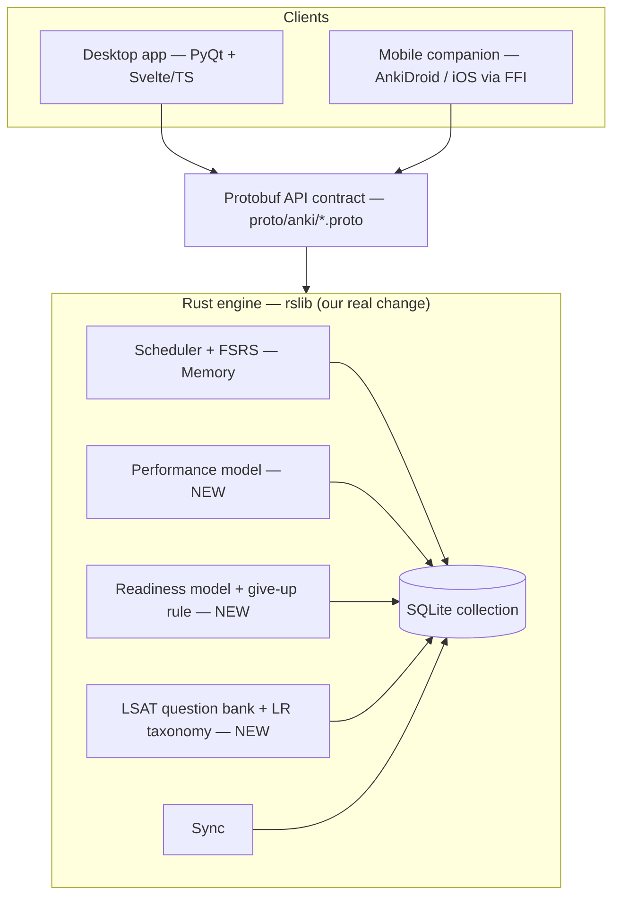
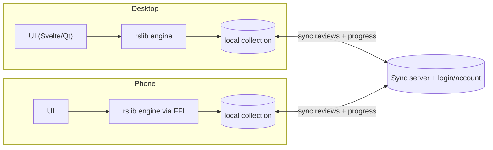
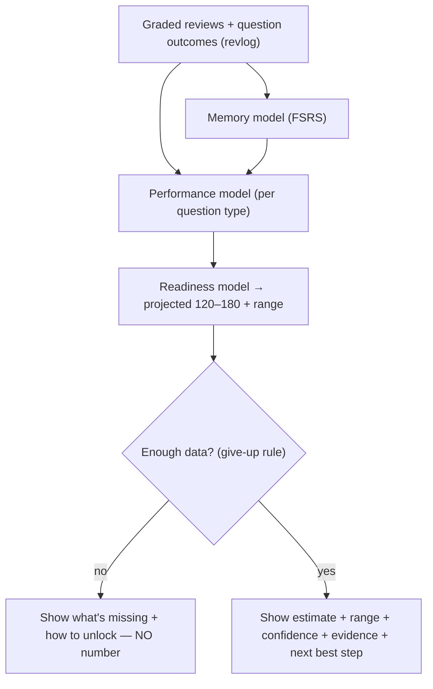
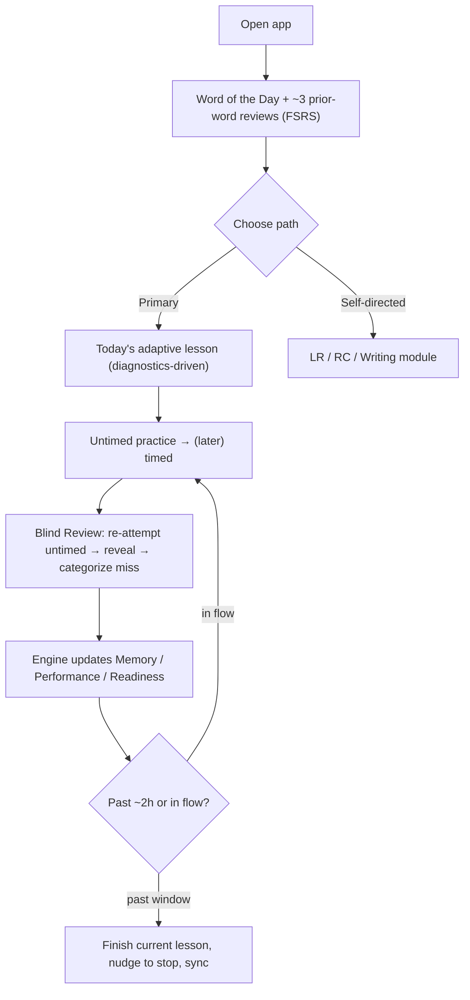

# Product Requirements Document — LSAT Speedrun

> A desktop + mobile LSAT preparation app built **inside** the Anki codebase (a real change to Anki's Rust engine, not a layer on top).

|                  |                                                                                                |
| ---------------- | ---------------------------------------------------------------------------------------------- |
| **Product name** | LSAT Speedrun (working title)                                                                  |
| **Exam**         | **LSAT** — scored **120–180**                                                                  |
| **Owner**        | Tiffany Lam (tiffany.lam@alphaaiengineering.com)                                               |
| **Status**       | Draft v1                                                                                       |
| **Codebase**     | Fork of [Anki](https://github.com/ankitects/anki) (AGPL-3.0-or-later; some parts BSD-3-Clause) |
| **Repo**         | `oshikanoma/lsat_app` (remote `lsat`), upstream `ankitects/anki`                               |

---

## 1. Vision

Most LSAT prep rewards **volume without structure, intensity without consistency, and pattern recognition without genuine reasoning**. We are building the opposite: an app that enforces the _conditions under which LSAT skill actually develops_ — distributed daily practice, real reasoning over memorization, and honest measurement of where the student actually stands.

We are **not building another flashcard app**. Flashcards solve memory. The LSAT is a reasoning exam with almost no facts to memorize, so we build the two harder bridges the assignment demands:

1. **Memory → Performance** — can the student answer a _new_ exam-style question that uses a concept?
2. **Performance → Readiness** — what LSAT score would they get today, and how sure are we?

### The honesty rule (non-negotiable)

The app may **never** display a readiness score unless it can simultaneously show:

- what evidence produced the number,
- what data is still missing,
- how accurate our past predictions turned out to be,
- the **range** of likely scores (never a single number alone),
- the single best next thing to study.

> A confident number with none of that behind it is not a prediction — it is a guess in a nice font. Dressing up a guess as a measurement is an automatic fail.

---

## 2. Problem statement

The LSAT prep market is broken in a diagnosable way:

- **Cramming is sold as a strategy** even though it is counterproductive for abstract reasoning (the Forgetting Curve; Cognitive Load Theory).
- **Volume is undersupplied** — the community benchmark for stable mastery is ~2,500 questions, but the average self-studier attempts only 500-1,000 before their first test.
- **Stamina is assumed, not trained** — the LSAT is ~2.5–3 hours of unrelenting reasoning; most students have never trained for that.
- **Tools don't separate "I knew it" from "I knew it but missed it under time"** — Blind Review exists precisely to surface that gap, but most apps ignore it.
- **RC is treated like LR** — taxonomy-driven drilling works for Logical Reasoning but fails for Reading Comprehension, which is a fluency problem.

---

## 3. Goals & non-goals

### Goals

- Ship a **desktop app** (primary) and a **phone companion** that **share one engine** and **sync** reviews/progress both ways, offline-tolerant.
- Make a **real change inside Anki's Rust code** (`rslib`), surfaced through the protobuf API to both clients.
- Show **three separate scores** — Memory, Performance, Readiness — each with a **range**, never blended into one number.
- Enforce **distributed, daily practice** (1–3 hr/day) with a flow-aware soft session cap.
- Drive study with **diagnostics**: the app guides the student to what they need most.
- Be **honest**: refuse to score without enough data; show evidence behind every number.

### Non-goals (MVP)

- Public app-store release (graders run via **emulator + local sync** for now).
- Logic Games content (removed from the LSAT as of August 2024 — do **not** build around it).
- Generic test-prep content not specific to the LSAT.
- Legal/admissions strategy content.
- A general-purpose chatbot.

---

## 4. Target user

**Persona:** "The Pre-Law Undergrad"

- Age **20–24**; college junior/senior, or on a gap year.
- Applying to law school; the LSAT is the gatekeeper to admission (and scholarship money).
- Studies in **two places**: at a desk (deep sessions) and on a **phone between classes** (light review).
- Motivated but at risk of cramming and burnout; needs structure and an honest read on readiness.

### Primary user story

> As an undergraduate applying to law school, I want to prepare for the LSAT in an engaging, structured way — and get an honest read on my projected score — so that I can improve efficiently and get accepted into law school.

### Supporting user stories

- _As a busy student_, I want short daily sessions that fit around classes, so I build skill without burning out.
- _As a commuter_, I want to review on my phone and have it show up on my desktop, so my progress is one continuous record.
- _As an anxious test-taker_, I want to know my projected score **and how confident the app is**, so I can trust it and know what to fix next.
- _As a careful learner_, I want untimed practice first and Blind Review, so I build accuracy before speed.

---

## 5. Guiding principles (learning science)

These are load-bearing product decisions, each grounded in a source (see Appendix).

| Principle                         | What it means for the product                                                                                  | Source                              |
| --------------------------------- | -------------------------------------------------------------------------------------------------------------- | ----------------------------------- |
| **Distributed > massed practice** | Default plan is **1–3 hr/day over 6–12 months**, not cram blocks.                                              | Cepeda et al. 2006; Ebbinghaus 1885 |
| **2,500-question threshold**      | Progress UI is framed against the ~2,500 graded-question mastery benchmark.                                    | r/LSAT, 7Sage                       |
| **Reasoning over recognition**    | Lessons build the underlying reasoning muscle, not just question-type labels.                                  | Nathan Fox; Mike Kim                |
| **LR is taxonomy-driven**         | LR module uses question-type taxonomy (Weaken, Assumption, Flaw, etc.) with prephrasing.                       | Killoran / PowerScore LR Bible      |
| **RC is fluency-driven**          | RC module emphasizes active reading (main idea, tone, viewpoints), **not** a taxonomy.                         | 7Sage, LSAT Demon                   |
| **Official questions matter**     | Use official LSAC-style PrepTest material as the gold standard; flag any third-party content as a risk.        | Ben Olson / Velocity                |
| **Blind Review**                  | After a timed set, re-do questions untimed before seeing answers; separate knowledge gaps from execution gaps. | J.Y. Ping / 7Sage                   |
| **Stamina is trained**            | Session length and pacing progressively build toward 3-hour endurance.                                         | Baumeister; Sweller                 |
| **Accuracy before speed**         | Untimed practice precedes timed; speed is introduced only once accuracy stabilizes.                            | Community consensus                 |

---

## 6. The exam (LSAT, as it works today)

- **Score scale:** 120–180 (median ≈ 151–152; 170+ ≈ 97th–98th percentile).
- **Scored sections:** **2× Logical Reasoning** + **1× Reading Comprehension** (~23–27 questions each; ~75 total).
- **LR ≈ two-thirds of the scored exam.**
- **Writing sample:** a separate **argumentative writing** task, **unscored** but required for the application.
- **Logic Games: removed (Aug 2024)** — explicitly out of scope.
- Digital, remote-proctored since 2019/2020.

> **Modeling note:** The Readiness score (120–180) is driven by the **two scored sections (LR + RC)**. The **Argumentative Writing** module is included as a practice/feedback feature but **does not contribute to the 120–180 projection** (it is unscored on the real test). This is called out explicitly to honor the honesty rule.

---

## 7. MVP scope

### 7.1 Home screen layout

1. **Word of the Day** card pinned at the **top** (vocabulary flashcard — see 7.4).
2. **One large primary button → "Today's Lesson"** — the adaptive guided session (the heart of the app).
3. **Three section buttons** — Logical Reasoning · Reading Comprehension · Argumentative Writing — for self-directed practice.
4. **The three scores** (Memory / Performance / Readiness) with ranges and an "honesty panel."
5. **Daily progress + streak**, framed against the distributed-practice plan.

> Students _may_ freely choose a section, but the **diagnostics surface what they need most** and steer them toward it.

### 7.2 Adaptive guided lessons (primary loop)

- The app continuously assembles **curated lessons** based on the student's correct/incorrect history.
- Targets the **weakest, highest-leverage** area next (e.g., a specific LR question type, or an RC skill).
- **Untimed first**, then introduces time pressure once accuracy stabilizes.
- Integrates **Blind Review**: timed attempt → untimed re-attempt → reveal + categorize the miss (knowledge gap vs execution gap).

### 7.3 Section modules

- **Logical Reasoning** — taxonomy-driven: break stimulus into premises/conclusion, identify question type, prephrase before reading answers. Question types: Must Be True, Main Point, Weaken, Strengthen, Assumption (Necessary/Sufficient), Justify, Flaw, Inference, Resolve/Explain, Parallel, Principle, etc.
- **Reading Comprehension** — fluency-driven: active reading of dense passages (humanities, social science, natural science, law); identify main idea, author tone, contrasting viewpoints.
- **Argumentative Writing** — structured prompt practice with feedback (unscored toward readiness).

### 7.4 Word of the Day (the flashcard component, used honestly)

Flashcards are **not** the core score model (the LSAT has almost no facts). They serve the one genuinely memory-based need — **vocabulary** — and provide a daily engagement hook, powered by Anki's existing **FSRS**.

- Each day adds a new card: a **statistically "hard" LSAT word**, its **definition**, and a **usage/context question**.
- Over time this becomes a **full spaced-repetition deck** of high-frequency hard words.
- The app also **re-asks prior words** (~3 questions/day) via FSRS scheduling. (Days 1–3 have too few words to do this — handled gracefully.)

### 7.5 Session time management (flow-aware cap)

- Default guidance: **~2 hours/day**, grounded in the 1–3 hr cognitive-quality window.
- **Soft, not hard:** if a student is mid-lesson / in flow, the app lets them **finish the current lesson** rather than cutting them off — lessons complete **around** the cap, not exactly at it.
- Gentle nudge to stop once past the window; emphasizes consistency over intensity.

### 7.6 Accounts, login & sync

- **Login page** so a student signs in and **syncs progress across desktop and mobile**.
- MVP runs via **emulator + local sync** (no public release yet); UI/UX adapts per screen (desktop vs phone).
- Reviews/progress must flow **both ways** without loss or double-counting; **offline then sync on reconnect**.

---

## 8. The three measurements (show them separately)

Each score is computed in the **Rust engine** and exposed via the protobuf API to **both** apps.

| Score           | Question it answers                                                       | Basis                                                                  |
| --------------- | ------------------------------------------------------------------------- | ---------------------------------------------------------------------- |
| **Memory**      | Can the student recall a fact/word taught right now?                      | Anki **FSRS** (retrievability) — already strong; we reuse it.          |
| **Performance** | Can the student get a **new, unseen** exam-style question right?          | **NEW** model over graded question history, per question type / skill. |
| **Readiness**   | What **LSAT score (120–180)** would they get today, with what confidence? | **NEW** model mapping performance + coverage → scaled score + range.   |

### 8.1 Required readiness display fields

Every readiness display must include: **point estimate**, **likely range**, **% of exam covered so far**, a **confidence indicator**, **last-updated time**, **main reasons** behind the number, and the **give-up rule**.

Example (target presentation):

```
Projected LSAT: 162
Likely range: 157–166
Confidence: low — you've covered 38% of LR question types and only 2 timed RC passages.
Next best step: Necessary Assumption questions (your weakest LR type).
Last updated: today, 4:12 PM
```

### 8.2 The give-up rule (written down)

> **The app shows NO readiness score until the student has at least 200 graded practice questions across the two scored sections AND ≥ 50% coverage of the LR question-type taxonomy AND ≥ 3 completed timed RC passages.**

Until then, the readiness panel shows **what's missing and how to unlock it** instead of a number. A system that knows when it doesn't know.

---

## 9. AI requirements

Every AI output must (1) come from a **named source**, (2) be **checked against a held-out test set**, and (3) **beat a simpler baseline**. No AI ships before the Wednesday milestone.

| AI feature                    | Named source / inputs                                             | Baseline it must beat                      | Eval                                                                     |
| ----------------------------- | ----------------------------------------------------------------- | ------------------------------------------ | ------------------------------------------------------------------------ |
| **Performance model**         | Student's graded review history (revlog) + question-type metadata | Raw % correct per type                     | Accuracy / calibration on held-out questions                             |
| **Readiness model**           | Performance + coverage features                                   | Linear map from overall accuracy → 120–180 | Predicted vs actual on held-out practice tests; calibration of the range |
| **Adaptive lesson selection** | Official LSAC-style question bank + diagnostic history            | Random / fixed-order selection             | Improvement in next-session accuracy on targeted skill                   |
| **Word-of-the-Day selection** | Corpus of statistically frequent hard LSAT words                  | Random word pick                           | Coverage of high-frequency words                                         |

**Reproducibility:** all models are tested on **held-back data** using a **fixed, scripted train/test split** that someone else can re-run and get the same result.

**AI-off mode:** both apps must run with **AI switched off** (deterministic fallbacks: FSRS-only scheduling, fixed lesson order, no generated content).

---

## 10. Architecture

### 10.1 Layered stack (where our changes live)

Anki is five layers. The rules require our logic to live in the **bottom (Rust) layer**, surfaced upward.



### 10.2 Two apps, one engine (+ sync + login)



> The phone app must **not** reimplement the scheduler in Swift/JS. It runs the **same Rust engine** (AnkiDroid backend on Android; Rust backend via C FFI on iOS).

### 10.3 Three-score pipeline + honesty gate



### 10.4 Daily user flow



---

## 11. Tech stack

- **Foundation:** Brownfield fork of the **Anki** codebase (~300k LOC).
- **Engine:** **Rust** (`rslib`) — scheduler, FSRS, our new performance/readiness/question-bank modules, sync, SQLite storage.
- **API contract:** **Protocol Buffers** (`proto/anki/*.proto`).
- **Desktop:** **Python** (`pylib`, `qt`/`aqt` with PyQt) + **TypeScript/Svelte** (`ts/`) rendered in QtWebEngine.
- **Mobile:** **AnkiDroid** (Android, Kotlin/Java over the Rust backend) and **iOS via C FFI** into `rslib`.
- **Diagrams:** **Mermaid** (architecture in this PRD and the README).
- **Build:** Rust (rustup 1.92.0) + `n2`; Anki's build bootstraps its own Python, Node, and protoc.
- **License:** AGPL-3.0-or-later, with credit to Anki (some Anki components BSD-3-Clause).

---

## 12. Compliance matrix — "the rules you cannot break"

| Rule                                       | How we satisfy it                                                       | Location                  |
| ------------------------------------------ | ----------------------------------------------------------------------- | ------------------------- |
| Real change in Anki's **Rust** code        | New performance/readiness/question-bank modules                         | `rslib/src/...`           |
| Two apps, one engine, syncing              | Desktop (Qt) + mobile (AnkiDroid/iOS FFI) sharing `rslib`; two-way sync | `rslib/src/sync`, clients |
| Three scores, each with a **range**        | Separate Memory/Performance/Readiness outputs with intervals            | proto + `rslib`           |
| Test on held-back data, reproducibly       | Scripted fixed train/test split + eval harness                          | repo `tools/` or `eval/`  |
| A/B one feature (on/off)                   | Feature flag + hypothesis + measurement (see §13)                       | engine flag + config      |
| AI: named source, test set, beats baseline | See §9                                                                  | models + eval             |
| **Refuse to score** without data           | Give-up rule (§8.2) enforced in engine                                  | `rslib` readiness module  |
| Ship installers, run with AI **off**       | `tools/build-installer` (.dmg) + AI-off mode                            | build + config            |
| License/attribution                        | AGPL-3.0-or-later, credit Anki; keep headers                            | `LICENSE`, `README`       |

---

## 13. A/B experiment plan (pick one feature)

**Chosen feature:** **Blind Review prompts** in the adaptive lesson loop.

- **Hypothesis:** Requiring an untimed re-attempt before revealing the answer (vs. immediate reveal) increases **accuracy on the next session's questions of the same type** by separating knowledge gaps from execution gaps.
- **Method:** Toggle Blind Review on/off behind a feature flag; compare next-session accuracy on matched question types.
- **Why it's a good A/B:** clean on/off, measurable short-horizon outcome, strong source backing (J.Y. Ping / 7Sage).

> Alternate candidate kept on the bench: the **flow-aware daily session cap** (hypothesis: improves day-over-day retention and reduces fatigue errors). Harder to measure on a short timeline, so it is the principle, not the primary A/B.

---

## 14. Data & licensing (decided)

**Why this matters.** Official LSAT questions are **owned and copyrighted by LSAC**. Their site Terms of Use explicitly **prohibit robots/scrapers**, and the LSAT Candidate Agreement bans copying or redistributing test content (with $500,000 liquidated-damages language). This is actively enforced: in **December 2024 LSAC sued an "AI Tutor for LSAT" company (Chatty Courses)** for buying a LawHub subscription, copying its content, and using it in their product — almost exactly the failure mode we must avoid. Third-party banks (7Sage, PowerScore, LSAT Demon) are likewise copyrighted and ToS-protected. **Scraping is therefore out of scope** — it is both illegal and a direct violation of this project's honesty/licensing bar (AGPL + attribution).

**Decision — content sourcing for the MVP:**

1. **Original starter bank (ship this).** A small set of **original, LSAT-style** LR/RC questions + a vocabulary set, authored for the project. We own the copyright, so it is safe to bundle. Lives in `lsat/content/` with a documented schema. This seeds the demo deck end-to-end (review loop + three scores + give-up rule).
2. **User-import / bring-your-own (primary path for real use).** The app is the **engine**; the **user** supplies content they legally own — e.g., their **free LawHub account** (4 full official PrepTests + free drill sets). We ship **zero** copyrighted content and never redistribute imports. Anki's existing import model is the foundation; our import format mirrors the schema in (1).
3. **Synthetic generation (optional volume booster, guarded).** LLM-generated LSAT-style questions are allowed **only** under the project's AI rules: a **named source/model**, validated against a **held-out test set**, and must **beat a baseline**. Must **not** be prompted/trained on scraped LSAC content. Caveat (Ben Olson): non-official questions can build wrong intuitions, so synthetic items are clearly labeled and kept secondary.
4. **Official licensing (future / real-product path).** LSAC runs a formal content-licensing program (`licensing@LSAC.org`) and a "link to LawHub" integration model. Out of scope for the deadline; documented as the path if this becomes a shipped product.

**Research datasets — eval only, do not ship.** Academic LR sets like **ReClor** and **LogiQA** (derived from LSAT/GMAT-style items) are typically **research-use-only** and may not be bundled. They may be used **only** in the offline eval/benchmark harness, never as in-app content.

**Provenance is a first-class field.** Every question record carries a `provenance` tag (`original` | `user-imported` | `synthetic` | `licensed`) and a `source` string. The UI and the scoring engine can filter by provenance (e.g., the AI-off / shippable build uses only `original` + `user-imported`).

---

## 15. Milestones (build in order: make it work → add AI → prove it)

### Wednesday — core works on both screens, **no AI**

**Desktop**

- Anki forked and building from source. ✅ (done — building & running)
- Our **Rust change** working end-to-end: the diff + **3 Rust unit tests** + **1 test that calls it from Python**.
- A **review loop** running on the LSAT deck.
- A **Memory** model with an honest score (range + give-up rule).
- An **installer** that runs on a clean machine.

**Mobile**

- A phone app that **builds and runs** on a real device or emulator.
- Loads the LSAT deck and runs a **real review session on the shared engine** (two-way sync not required yet).

**Proof:** commit hash + clean-build recording, test results, clean-machine install recording, phone review-session recording.

### Friday — AI added & checked; phone syncs and shows readiness

- Performance + Readiness models live, each from a **named source**, **beating a baseline**, validated on **held-out** data.
- **Two-way sync** working; phone shows the **three scores with ranges** and follows the give-up rule.

### Sunday — prove it & ship

- Reproducible eval anyone can re-run.
- **Installable builds for both** desktop and phone, each running with **AI off**.

---

## 16. Success metrics

- **Engine:** three scores returned with calibrated ranges; give-up rule verifiably blocks low-data scores.
- **Model quality:** readiness predictions beat baseline on held-out data; ranges are well-calibrated (actual scores fall in the stated range at the stated rate).
- **Cross-device:** a review on phone appears on desktop (and vice versa) with no double-counting, including after offline.
- **Engagement (pedagogical):** daily-session adherence within the 1–3 hr window; progress toward the 2,500-question benchmark.

---

## 17. Risks & open questions

- **Question licensing** (official LSAC content) — see §14. _Decision needed._
- **Cold-start data sparsity** — readiness is hidden early by design; ensure the "what's missing" UX is motivating, not discouraging.
- **RC is hard to "app-ify"** (fluency, not taxonomy) — risk that drilling underperforms; mitigate with active-reading exercises, not question-type labels.
- **iOS FFI complexity** — running `rslib` through the C interface is non-trivial; AnkiDroid path is lower-risk for the mobile MVP.
- **Range calibration honesty** — ranges must reflect true uncertainty, not be cosmetic.
- **Writing module scope** — unscored; keep lightweight so it doesn't distort the readiness model.

---

## 18. Out of scope (MVP)

- Public app-store distribution.
- Logic Games content/strategy (removed from the LSAT Aug 2024).
- Non-LSAT test-prep methodologies (SAT/ACT/GRE).
- Legal or admissions strategy content.
- General-purpose chatbot.

---

## Appendix A — Experts

- **Nathan Fox** — Fox LSAT / LSAT Demon; explanation-first, anti-rote-drilling. <https://lsatdemon.com>
- **David M. Killoran** — PowerScore; LR Bible (taxonomy gold standard). <https://powerscore.com>
- **Mike Kim** — _The LSAT Trainer_; unified reasoning skill over rigid taxonomy. <https://thelsattrainer.com>
- **J.Y. Ping** — 7Sage; formalized **Blind Review**. <https://7sage.com>
- **Ben Olson** — Velocity LSAT; official LSAC questions are non-negotiable. <https://youtube.com/velocitylsat>

## Appendix B — Key references

- Ebbinghaus, H. (1885). _Über das Gedächtnis_ — the Forgetting Curve.
- Cepeda, N.J. et al. (2006). _Distributed Practice in Verbal Recall Tasks_. _Psychological Bulletin_, 132(3), 354–380.
- Baumeister, R.F. et al. (1998). Ego depletion. _J. Personality and Social Psychology_, 74(5).
- Sweller, J. (1988). Cognitive Load Theory. _Cognitive Science_, 12(2), 257–285.
- LSAC official LSAT information. <https://www.lsac.org/lsat>
- r/LSAT community data; 7Sage analytics & study schedule.

## Appendix C — Core SPOVs

1. **1–3 hours/day, sustained over months** yields the best retention and consistency — an app should _coach the student like an athlete_, not maximize daily hours.
2. **~2,500 questions over ~8–9 months** is the realistic minimum for mastery — volume and timeline are mathematically coupled; you cannot honestly shortcut either.
